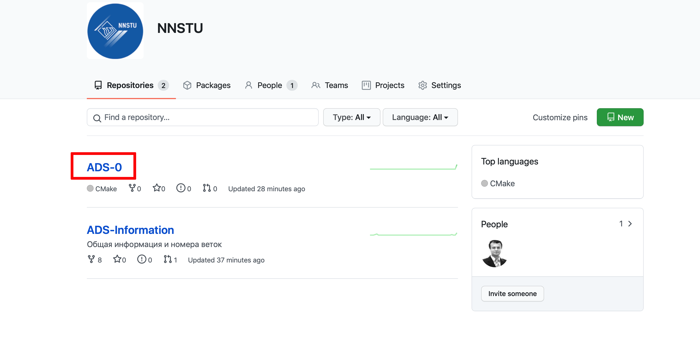
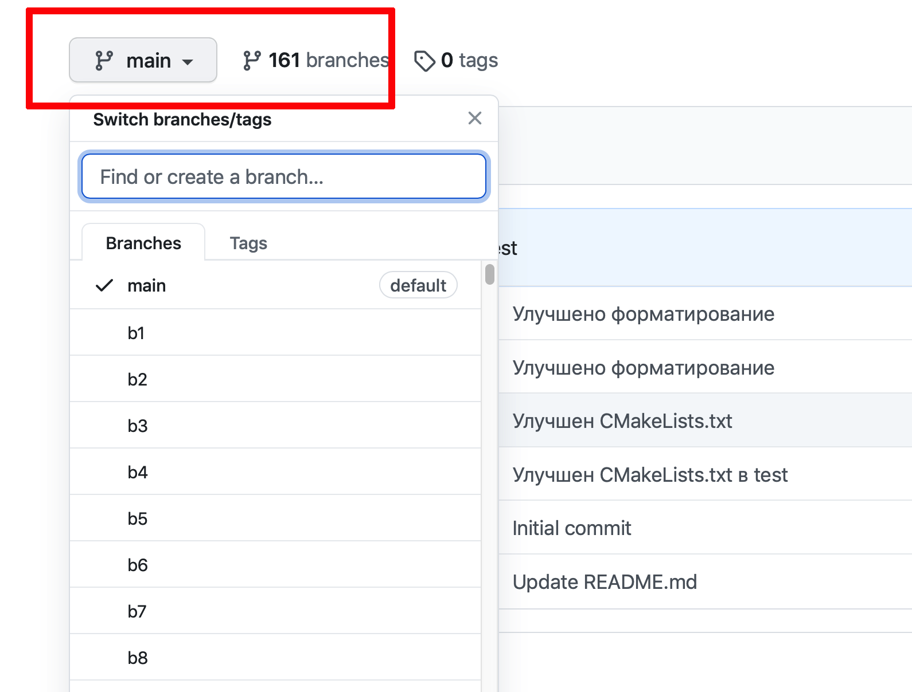
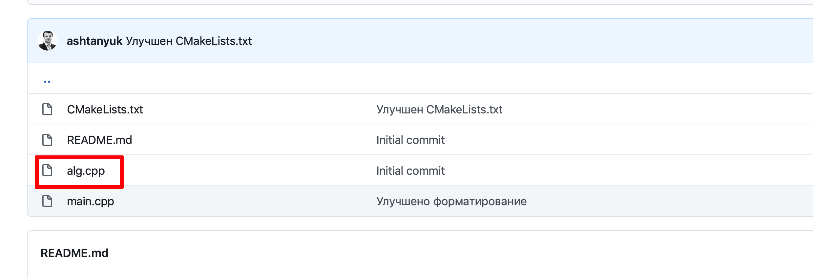
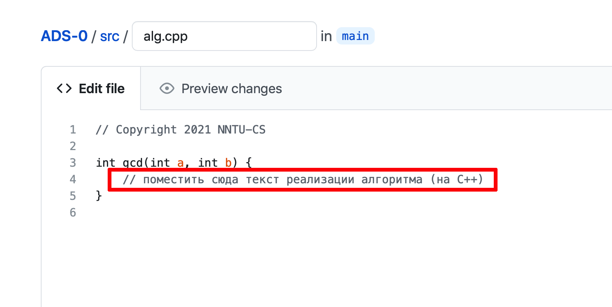

# Инструкция о выполнении заданий на сервисе **GitHub**

Для начала работы необходимо создать бесплатный аккаунт на сайте **github.com**.

## Алгоритм выполнения практической работы

- После входа в систему (*Sign in*) переходим на страницу организации *https://github.com/NNTU-CS*

- Выбираем репозиторий с практическим заданием (в примере **ADS-1**)

- Нажимаем кнопку **Fork** в правом верхнем углу окна

- Начинается процесс копирования репозитория в аккаунт пользователя

- После окончания копирования мы возвращаемся в свой аккаунт (вместо **ashtanyuk** будет ваше имя пользователя)

- Переходим в каталог **src**, выбираем кнопку **Create new file**

- Указываем имя файла **alg.cpp**, в окошко вводим текст функции

- Нажимаем внизу на зеленую кнопку **Commit**

- Нажимаем справа на надпись **Pull Request**

- В выпадающем списке выбираем ветку со **своим** номером 
- Нажимаем  на зеленую кнопку **Create pull request**

Далее, в целевом репозитории создается очередь из пул-запросов на проверку. Для каждого запроса выполняется автоматическая процедура построения программы и тестирования. Успешное окончание тестирования сопровождается зеленой галочкой, неуспешное - красным крестиком. Работа засчитывается, если она успешно прошла тестирование.

# Список участников (веток)

|№	|ФИО|	Группа	|Ветка|
|---|---|--------|-----|
|1|АджуджЮнис | 20-ИСТ-1 | b1|
|2|Акимкин Алексей | 20-ИСТ-1 | b2|

